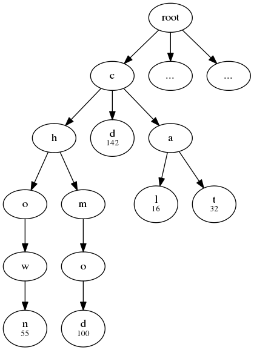

# Predictive-shell

Objective
=========

First, to create the framework for a predictive keyboard of bash
commands. Once the framework is completed, the idea is to create an App
to make secure shell that uses work prediction to allow and easy and
agile interaction with the server.

Theory
======

The section will be split in to parts: word completion and word
prediction. The methods presented here are just the base ideas, in the
creation of the framework itself many applications of these ideas may
vary.

Word completion
---------------

Word completion will be mainly accomplished by using what is called a
trie, that is an organization of words using the letters as the nodes of
a tree, which by following the one way edges one recovers the words
@trie. Tries provide a simple yet effective way to do word completion by
storing how many times each word is used in the tree itself, thus
allowing for a prediction of the incomplete input based on the user
history. To illustrate the main idea lets think of an example, imagine
we have a word history input of these commands.

    chmod  = 100
    chown  = 55
    cd     = 142
    cat    = 32
    cal    = 16

[ex1]

The image [ex1] represents the trie formed using that input history. The
nodes with numbers on them represent the number of times the input of
the word formed by following the tree from root to that node has been
used by the user. Imagine the user enters the character `c` the results
of auto completion are obtained by traversing the trie from the node $c$
to all the child-nodes that have completed commands, then it returns all
of them and their used number value to make a hierarchical suggestion of
these based on that number. In these case that would be
`cd chmod chown cat cal`.

Its is important to notice that although this method presents a solution
for word auto completion it fails when faced with the problem of “fuzzy
search” that is for example if the user inputs the following `chdwm` we
want our program to include `chown` as the first suggestion, however
this cannot be accomplished by using this type of algorithms. A solution
to these problem could be obtained by including in our system what is
called as BK-Trees, a small explanation of how they work can be found in
@bk-tree.

Word prediction
---------------

Word prediction is accomplished by using what is called an n-gram,
basically an statistical analysis to obtain prediction when given a
certain n-1 things, what’s is the n-th thing that follows. In this
case we will use `1` and `2` word grams to predict given a certain word
or two which one comes next. To make the prediction system more
efficient and less cumbersome, the statistical analysis will be made
using Bayesian interference @Baye which is essentially weighting the
probability of an event with a specified hypothesis. In this case our
hypothesis will be that command lines almost always come in the
structure of `command options paths`, with certain exemptions (ex. lines
using `|`). For example if the user inputs the following line:
`$HOME/dir/ another_dir/`, if we know that `$HOME/dir/` is not a command
using our hypothesis we can discard this input as noise and not take it
into account in the analysis. One challenge that arises from this is
that we need to be able to characterize in which category each word
falls, luckily for us there are some key aspects that will help in that
process (ex. the common appearance of the symbol `/` in paths).

References
==========
>R. Sedgewick and K. Wayne,Tries,(http://algs4.cs.princeton.edu/lectures/52Tries.pdf)
>N. Johnson,BK-Trees,(http://blog.notdot.net/2007/4/Damn-Cool-Algorithms-Part-1-BK-Trees)
>Bayesian Interference,(https://en.wikipedia.org/wiki/Bayesian_inference)